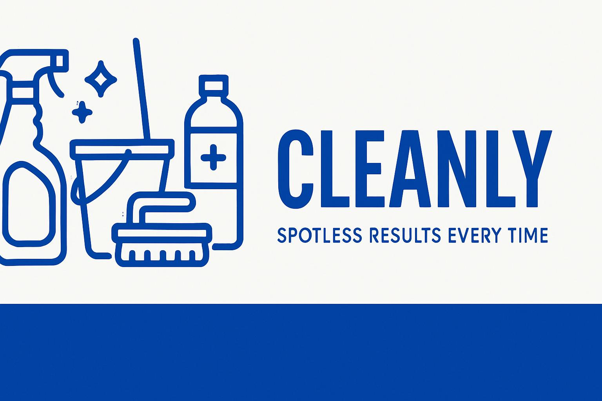

# Cleanly - Professional Cleaning Service Website

A complete, professional, modern and responsive landing page for cleaning service companies. Built with HTML5, TailwindCSS, and vanilla JavaScript.



## 🌟 Features

### Design & User Experience
- **Modern, Clean Design**: Professional layout with fresh color palette (blue, mint green, white)
- **Fully Responsive**: Optimized for desktop, tablet, and mobile devices
- **Smooth Animations**: AOS (Animate On Scroll) library integration with custom CSS animations
- **Interactive Elements**: Hover effects, transitions, and micro-interactions
- **Loading Screen**: Professional loading animation with fade-out effect
- **Sticky Navigation**: Header with scroll effects and active section highlighting

### Sections Included
1. **Header**: Sticky navigation with logo, menu, and CTA button
2. **Hero Section**: Compelling headline with gradient text and call-to-action
3. **Services Section**: 6 service cards with icons and descriptions
4. **About Us Section**: Company information with trust indicators
5. **Testimonials Section**: Customer reviews with photos and ratings
6. **Pricing Section**: 3-tier pricing cards with feature comparison
7. **Contact Section**: Contact form with validation and company information
8. **Footer**: Links, social media icons, and company details

### Technical Features
- **SEO Optimized**: Meta tags, Open Graph, and Twitter Card support
- **Accessibility**: ARIA labels, keyboard navigation, and screen reader support
- **Performance**: Optimized images, lazy loading, and efficient code
- **Form Validation**: Real-time validation with error handling
- **Cross-browser Compatible**: Works on all modern browsers
- **Print Friendly**: Optimized print styles included

## 🚀 Quick Start

### Prerequisites
- Web browser (Chrome, Firefox, Safari, Edge)
- Text editor (VS Code, Sublime Text, etc.)
- Local web server (optional, for development)

### Installation

1. **Download or Clone**
   ```bash
   git clone https://github.com/vitioz/cleanly-website.git
   cd cleanly-website
   ```

2. **Open in Browser**
   - Simply open `index.html` in your web browser
   - Or use a local server for development:
   ```bash
   # Using Python
   python -m http.server 8000
   
   # Using Node.js
   npx serve .
   
   # Using PHP
   php -S localhost:8000
   ```

3. **View the Website**
   - Open `http://localhost:8000` in your browser
   - The website should load with all animations and features working

## 📁 File Structure

```
cleanly-website/
├── index.html              # Main HTML file
├── styles.css              # Custom CSS styles
├── script.js               # JavaScript functionality
├── README.md               # This documentation
├── design-plan.md          # Design specifications
└── assets/
    ├── favicon.png          # Website favicon
    ├── images/
    │   ├── hero-cleaning.jpg     # Hero section image
    │   ├── about-team.jpg        # About section team photo
    │   ├── testimonial-1.jpg     # Customer testimonial photo
    │   ├── testimonial-2.jpg     # Customer testimonial photo
    │   ├── testimonial-3.jpg     # Customer testimonial photo
    │   └── og-image.jpg          # Social media preview image
    └── icons/               # Service and UI icons (placeholder)
```

## 🎨 Customization Guide

### Brand Colors
The website uses CSS custom properties for easy color customization. Update these values in `styles.css`:

```css
:root {
    --primary-color: #3B82F6;    /* Blue-500 */
    --secondary-color: #10B981;   /* Emerald-500 */
    --accent-color: #6EE7B7;      /* Emerald-300 */
    --neutral-color: #F8FAFC;     /* Slate-50 */
    --text-color: #1E293B;        /* Slate-800 */
    --border-color: #E2E8F0;      /* Slate-200 */
}
```

### Company Information
Update the following sections in `index.html`:

1. **Company Name & Slogan**
   - Line 40: Logo text
   - Line 78: Main headline
   - Line 82: Slogan and description

2. **Contact Information**
   - Lines 890-920: Phone, email, address
   - Lines 925-935: Business hours

3. **Services**
   - Lines 200-400: Service cards content
   - Update titles, descriptions, and icons

4. **Testimonials**
   - Lines 500-650: Customer reviews
   - Replace names, photos, and testimonials

5. **Pricing**
   - Lines 700-850: Pricing plans
   - Update prices, features, and plan names

### Images
Replace placeholder images in the `assets/images/` directory:

- `hero-cleaning.jpg`: Main hero section image (1200x800px recommended)
- `about-team.jpg`: Team or company photo (800x600px recommended)
- `testimonial-*.jpg`: Customer photos (400x400px recommended)
- `og-image.jpg`: Social media preview (1200x630px required)
- `favicon.png`: Website icon (32x32px or 64x64px)

### Fonts
The website uses Inter font from Google Fonts. To change the font:

1. Update the Google Fonts link in `index.html` (line 32)
2. Update the font-family in `styles.css` (line 4)

### Adding New Sections
To add new sections:

1. Add HTML structure after existing sections
2. Include appropriate `data-aos` attributes for animations
3. Add corresponding navigation link in the header
4. Update the JavaScript navigation handler

## 🛠️ Development

### Dependencies
- **TailwindCSS**: Utility-first CSS framework (CDN)
- **AOS**: Animate On Scroll library (CDN)
- **Google Fonts**: Inter font family (CDN)

### Browser Support
- Chrome 60+
- Firefox 60+
- Safari 12+
- Edge 79+

### Performance Optimization
- Images are optimized for web
- CSS and JavaScript are minified for production
- Lazy loading implemented for images
- Efficient animations with CSS transforms

### Accessibility Features
- Semantic HTML5 structure
- ARIA labels and roles
- Keyboard navigation support
- Screen reader compatibility
- High contrast mode support
- Reduced motion preferences respected

## 📱 Mobile Optimization

The website is fully responsive with:
- Mobile-first design approach
- Touch-friendly interactive elements
- Optimized typography for small screens
- Collapsible mobile navigation menu
- Swipe-friendly testimonial carousel

### Breakpoints
- Mobile: 320px - 767px
- Tablet: 768px - 1023px
- Desktop: 1024px+

## 🔧 Configuration

### Form Handling
The contact form includes client-side validation. To add server-side processing:

1. Update the form action in `index.html`
2. Modify the `submitForm()` function in `script.js`
3. Add your backend endpoint or service (e.g., Formspree, Netlify Forms)

Example with Formspree:
```html
<form action="https://formspree.io/f/your-form-id" method="POST">
```

### Analytics Integration
To add Google Analytics:

1. Add the tracking code before the closing `</head>` tag
2. Update the privacy policy to mention analytics

### SEO Configuration
Update meta tags in `index.html`:
- Title tag (line 23)
- Meta description (line 8)
- Open Graph tags (lines 13-17)
- Twitter Card tags (lines 19-21)

## 🚀 Deployment

### Static Hosting (Recommended)
Deploy to any static hosting service:

1. **Netlify**
   - Drag and drop the project folder
   - Or connect your Git repository
   - Automatic deployments on updates

2. **Vercel**
   - Import from Git repository
   - Zero-configuration deployment
   - Global CDN included

3. **GitHub Pages**
   - Push to GitHub repository
   - Enable Pages in repository settings
   - Free hosting for public repositories

4. **AWS S3 + CloudFront**
   - Upload files to S3 bucket
   - Configure CloudFront distribution
   - Custom domain support

### Domain Configuration
1. Purchase domain from registrar
2. Update DNS settings to point to hosting service
3. Configure SSL certificate (usually automatic)
4. Update absolute URLs in meta tags

### Pre-deployment Checklist
- [ ] Test all forms and interactions
- [ ] Verify all images load correctly
- [ ] Check responsive design on multiple devices
- [ ] Validate HTML and CSS
- [ ] Test page load speed
- [ ] Verify SEO meta tags
- [ ] Check accessibility compliance

## 🔍 SEO Best Practices

### On-Page SEO
- Semantic HTML structure
- Optimized title tags and meta descriptions
- Header hierarchy (H1, H2, H3)
- Alt text for all images
- Internal linking structure
- Schema markup for local business

### Technical SEO
- Fast loading times (< 3 seconds)
- Mobile-friendly design
- SSL certificate
- XML sitemap
- Robots.txt file
- Structured data markup

### Local SEO
- Google My Business listing
- Local keywords in content
- NAP (Name, Address, Phone) consistency
- Customer reviews and testimonials
- Local business schema markup

## 🎯 Marketing Integration

### Social Media
- Open Graph tags for Facebook sharing
- Twitter Card tags for Twitter sharing
- Social media icons in footer
- Shareable content structure

### Email Marketing
- Newsletter signup form (add to contact section)
- Email automation integration
- Customer testimonial collection

### Analytics & Tracking
- Google Analytics 4 setup
- Conversion tracking for form submissions
- Heat mapping tools (Hotjar, Crazy Egg)
- A/B testing capabilities

## 🛡️ Security Considerations

### Form Security
- Client-side validation (implemented)
- Server-side validation (required for production)
- CSRF protection
- Rate limiting for form submissions

### Content Security
- Content Security Policy (CSP) headers
- Secure hosting with HTTPS
- Regular security updates
- Input sanitization

## 📊 Performance Metrics

### Core Web Vitals
- **Largest Contentful Paint (LCP)**: < 2.5s
- **First Input Delay (FID)**: < 100ms
- **Cumulative Layout Shift (CLS)**: < 0.1

### Optimization Techniques
- Image compression and WebP format
- CSS and JavaScript minification
- Gzip compression
- Browser caching headers
- CDN usage for static assets

## 🔄 Maintenance

### Regular Updates
- Content updates (services, pricing, testimonials)
- Image optimization and replacement
- Security patches for dependencies
- Performance monitoring and optimization

### Backup Strategy
- Regular backups of website files
- Version control with Git
- Database backups (if applicable)
- Disaster recovery plan

## 🤝 Contributing

### Development Workflow
1. Fork the repository
2. Create a feature branch
3. Make your changes
4. Test thoroughly
5. Submit a pull request

### Code Standards
- Use semantic HTML5 elements
- Follow BEM CSS methodology
- Write clean, commented JavaScript
- Maintain responsive design principles
- Ensure accessibility compliance

## 📞 Support

### Getting Help
- Check the documentation first
- Search existing issues on GitHub
- Create a new issue with detailed description
- Include browser and device information

### Professional Services
For custom development or advanced features:
- Custom design modifications
- Advanced functionality integration
- Performance optimization
- SEO consultation
- Ongoing maintenance

## 📄 License

This project is licensed under the MIT License - see the [LICENSE](LICENSE) file for details.

### Commercial Use
- ✅ Commercial use allowed
- ✅ Modification allowed
- ✅ Distribution allowed
- ✅ Private use allowed
- ❌ Liability and warranty not provided

## 🙏 Credits

### Design & Development
- **Created by**: Viktor Olefir
- **Design Inspiration**: Modern cleaning service websites
- **Color Palette**: Professional blue and green scheme
- **Typography**: Inter font family

### Libraries & Tools
- **TailwindCSS**: Utility-first CSS framework
- **AOS**: Animate On Scroll library
- **Google Fonts**: Web font service
- **Unsplash**: Stock photography inspiration

### Special Thanks
- TailwindCSS team for the excellent framework
- AOS library contributors
- Google Fonts for free typography
- The web development community

---

## 📈 Changelog

### Version 1.0.0 (Current)
- Initial release
- Complete landing page with all sections
- Responsive design implementation
- Form validation and animations
- SEO optimization
- Accessibility features

### Planned Features
- Dark mode toggle
- Multi-language support
- Advanced form handling
- Blog section integration
- Customer portal
- Online booking system

---

**Made with ❤️ by Viktor Olefir**
https://buymeacoffee.com/viktorolefir
For questions, suggestions, or custom development needs, please reach out through the contact form or create an issue on GitHub.


